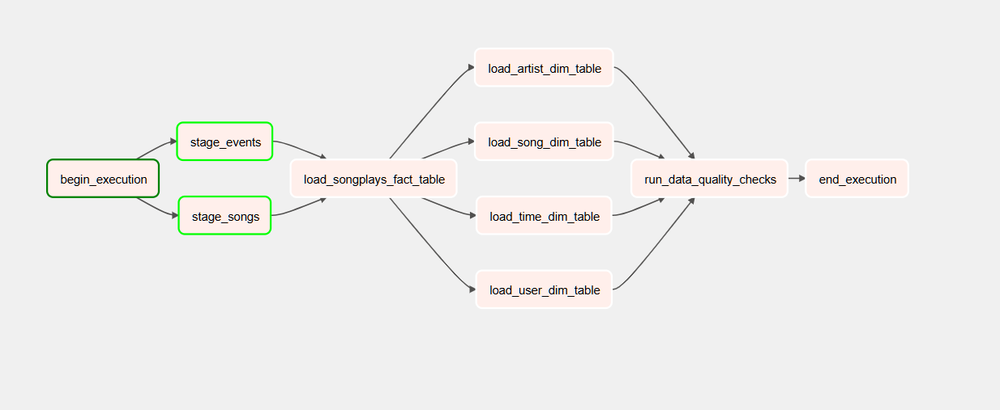
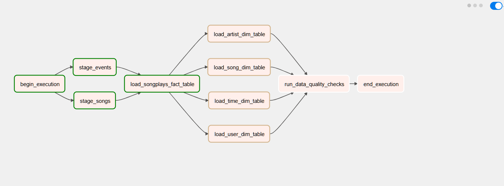
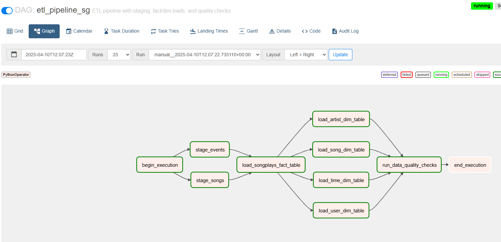
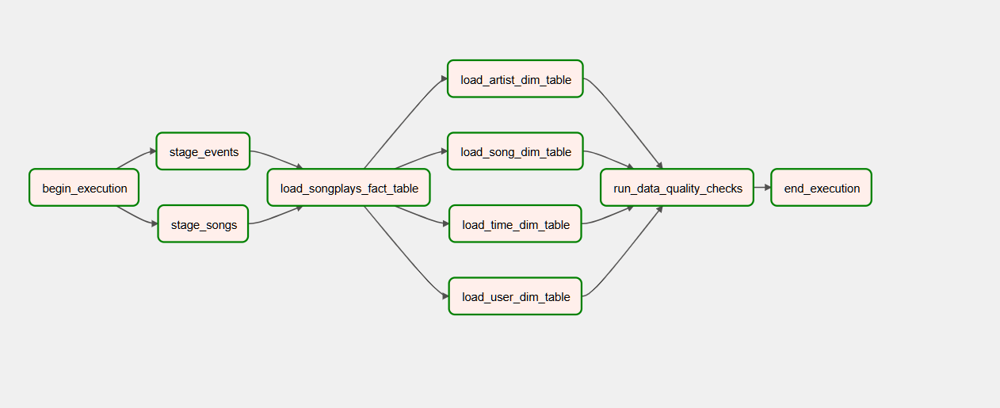

# Airflow ETL Pipeline

This project demonstrates how to create and manage an ETL pipeline using Apache Airflow. It covers the setup of a robust Airflow environment, file organization, DAG creation, and task dependencies, culminating in a fully functional data pipeline.
## Project Overview
The pipeline orchestrates the following steps:

Getting Started
1. Set Up the Environment


2. Prepare the Configuration File
Create a  file to store Redshift connection and AWS credentials:

Replace  and other placeholder values with actual AWS and Redshift details.

3. Set Up SQL Files


4. Connect to PostgreSQL/Redshift
Use  to verify the Redshift connection:

Run the script:

5. Create the DAG
Define the Airflow DAG in ```etl_pipeline_sg```


DAG Dependencies
The DAG includes the following tasks with these dependencies:
```
begin_execution >> [stage_events, stage_songs]
[stage_events, stage_songs] >> load_songplays_fact_table
load_songplays_fact_table >> [load_user_dim_table, load_song_dim_table, load_artist_dim_table, load_time_dim_table]
[load_user_dim_table, load_song_dim_table, load_artist_dim_table, load_time_dim_table] >> run_data_quality_checks
run_data_quality_checks >> end_execution
```

Graph View











